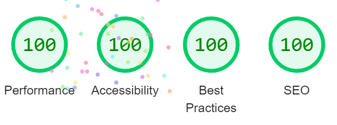

Assignment 3 - Persistence: Two-tier Web Application with Database, Express server, and CSS template
===

## Billing System

Glitch link: http://a3-joshua-cuneo.glitch.me

The web application is a billing system that can add, view, update, and delete purchase data. Tha data is stored in the database(MonogDB), which ensures persistency. 
The web application consists of multiple pages for different purposes:
1. The login page contains button to login using GitHub. The login page is simple with only login area containing a icon and button. The user is redirected to GitHub login page when button clicked and then redirected to the dashboard on success.
2. The dashboard page contains buttons to redirect to different pages like billingsystem, instructions, user-information, and logout. This page also displays the logged-in user's GitHub username indicating that the application will display only information specific to the user.
3. The billing system page contains the form to add purchase data and saved into the database when the submit button hit. The table below the form displays recorded purchase data and also includes final price, discount, after discount price. THE DATA DISPLAYED IN THE TABLE IS SPECIFIC TO THE LOGGED-IN USER. The table also consists of total price of all the purchases. The last column in the table has delete and update buttons
The delete button deletes the purchase record of the corresponding row from the database and displays the updated data. The update button opens a popup form with the corresponding row date populated for the user update information and when submitted the respective data is updated in the database and updated data is displayed.
The table is not displayed if there is not data for the logged-in user and instead a not is displayed. The adding, deleting, and updating of data is specific to the logged-in user only, which is manged by using their GitHub ID. 
4. The instructions page explains the user on how to use the application, especially adding, viewing, deleting, and updating operations.
5. The user-information page displays only the logged-in user's information such as username, ID, GitHub url, and user created date. 
This web application uses:
- NodeJS for server handling
- MongoDB for persistence databasing
- JavaScript for frontend client
- Handlebars(HTML) and CSS for frontend user-interface
This web application was designed using Express framework to handle rendering of frontend, routing, connecting to MongoDB database to add/fetch/delete/update data, and all other logical operations. 
The web application uses GitHub OAuth for logging the user. The GitHub strategy from passportJS was used to implement OAuth. 

**Technologies**:  
-*HTML*:
- The HTML pages use template engine called handlebars which consist the frontend code.
- The main.handlebars is the base layout that is imported into all other handlebar files using template engine to avoid repetition of base layout and html syntax. 
- The HTML form to add purchase data in billingsystem.handlebars uses different input tags like text, number, data and also select tag for dropdown.
- The HTML table in billingsystem.handlebars shows the purchase records specific to the authenticated user using their GitHub ID.
  - The HTML table consists of delete and update buttons for the user to delete or update corresponding records.
  - The add, delete, and update operations are specific to the authenticated user, which is ensured using the user's GitHub ID.
- The data received directly from the backend is displayed in handlebars or used a loop in the same file to display.

-*MongoDB*:
- MongoDB was used for data persistence as the data is stored in the database.
- The database created has two collections, where one stores user's GitHub information and the other stores purchase data with the GitHub ID to manage add, view, delete, and update operations.
- Mongoose schema was used to add/fetch/delete/update data in the database.
- Mongoose schema was used to save user's GitHub information only if it is their first login.
- The files in models handle the mongoose schema and db.js handles database connection.

-*JavaScript*:
- Frontend JavaScript was used for multiple purposes.
- It handles populating the popup form when the update button hit to update the form with the data in the corresponding row.
  - To populate the date field, the Date class is used to extract only the required information from the entire data object given by MongoDB.
- It is used for fetch() function call for DELETE because when the delete button is hit, the corresponding row-id is determined and the JS send the id to backend NodeJS to delete in the database and render back the page with updated data.

-*NodeJS*:
- Used Express framework for backend, frontend, and database connections

-*Google Lighthouse*:  

**the goal of the application**:
- The web application is designed to create a billing system that can add purchase data, view all the purchase records, delete or update any purchase records of the specific authenticated user. The web application also provides logged-in user's information and instructions page for the user to understand the application. 
The web application also uses persistency to ensure that data is always saved for the user to access anytime from anywhere.

**challenges you faced in realizing the application**:
1. Integrating the backend logic, database queries and schema, and rendering frontend with data using Express framework was challenging as had to research to figure Express functions and middleware to make the tasks mentioned possible.
2. Using passportJS for adding GitHub OAuth was challenging because it required to understand the strategy, add database logic to the strategy, and use it the routes.
   - The user is added to the database only if not existed.
3. Dealing with mongoose schema and writing the queries was challenging

**what authentication strategy you chose to use and why** (choosing one because it seemed the easiest to implement is perfectly acceptable):
- GitHub authentication strategy was used because GitHub is popular and most of the people have accounts in it. It is also easier for the user to login as they need to just click on the button and provide username and password to be able to access the web application.

**what CSS framework you used and why**
- Bootstrap CSS framework was used because it is popular and used widely. They have many components that could be directly integrated into the html code and importing the requirements is easy. Bootstrap was used for buttons, top-navigation bar, menu button, popup, table, and forms. Also, Bootstrap icons were used for the buttons.
- There were subtle modifications made via custom CSS to fit the requirement.
  - Padding for the buttons was increased 
  - The background color for the top-navigation bar was changes to include linear-gradient
  - The height of the popup was increased to make more form elements visible to avoid extensive scrolling

**a list of Express middleware packages you used and a short (one sentence) summary of what each one does.** If you use a custom function, please add a little more detail about what it does:
1. app.use(express.urlencoded({extended:false})) - To handle the form data received from the HTML form and handle the data by adding more data before inserting into database
2. app.use(bodyParser.urlencoded({extended:true})) - To handle form data and access specific elements of the data
3. app.use(methodOverride(function (req, res)) - To support PUT and DELETE requests as the HTML form can only submit POST requests
4. app.engine('handlebars', exphbs.engine({defaultLayout: 'main', extname:'handlebars'})) - To use handlebars as the template engine, which uses html code to create frontend user interface
5. app.use(session({}) - To create session for the logged-in user and set a cookie of 1 day
6. app.use(passport.initialize()) and app.use(passport.session()) - To use the GitHub strategy provided by passportJS for implementing OAuth

## Technical Achievements
- **Tech Achievement 1**: I used OAuth authentication via the GitHub strategy
  - Used PassportJS to implement the GitHub strategy
  - When the login with GitHub button clicked, the user goes to GitHub login page and redirected back to dashboard on success. The user stays logged-in until logout button clicked as session and cookies are used. The cookies expire after 1 day, so the user is automatically logged-in, if left the website and returned within the timeframe.
- **Tech Achievement 2**: Google Lighthouse
  - Got 100% for performance, best practices, accessibility, and SEO

## Design/Evaluation Achievements
- **Design Achievement 1**: I followed the following tips from the W3C Web Accessibility Initiative
1. Provide informative, unique page title - Every html page used has unique and meaningful title that the user can easily understand. For example, the dashboard page was titled dashboard to signify it is landing page or the home page for the user to go to any other page from here.
Similarly, all other pages have different titles like User Information to provide logged-in user information, Instructions to provide steps on how to use the website, and Login. 
2. Use headings to convey meaning and structure - Every page has meaningful headings and subheadings for the user to understand the purpose of the page. For example, the billing-system page has subheadings to indicate form for adding data, and table for viewing data. Also, each form input field has a label to indicate the purpose of that field. Different sizes of h-tags were used. 
3. Provide clear instructions - There is an instruction page to guide the user on how to use the web application, especially for adding/viewing/deleting/updating purchase data. Also the form fields have placeholders that display what values to enter, which makes it easier for the user to comprehend. Also, aria-labels were added to the form input fields.
4. Keep content clear and concise - The content in all pages is well spaced and aligned using flexbox, paddings, and margins for the user to easily read. Also, the content is in the form of pointers using ordered/unordered list tags instead of paragraphs for the user to quickly read. 
5. Provide sufficient contrast between foreground and background - The background in all the pages are light colors and the foreground are dark color to highlight the main objects of the page. Elegant and vibrant colors were used and maintained contrast between background and foreground to not blend both of them.
6. Don't use color alone to convey information - Only color was not used to convey information, but there was relevant and minimal text to support the purpose of the element. For example the buttons were colored according to their purpose, but also had text on them. Also, there are icons for a few buttons to make it easier for the user to understand. 
7. Ensure that interactive elements are easy to identify - Interactive elements like buttons, links, menu button has the cursor:pointer attribute set to change to a hand symbol when hovered over them.
8. Provide clear and consistent navigation options - The user can easily navigate from any page to any page. The dashboard has buttons with icons to redirect to any other page. Remaining all other pages have a menu button in the top-navigation bar to redirect to another page, done by just clicking on the links which show up in a side-navigation when menu hit. The user can logout from any page.
9. Ensure that form elements include clearly associated labels - All the input fields in the form have labels, which act like a subheading for each input field to signify what the user needs to type. Also the labels have label-for attribute to increase accessibility.
10. Use headings and spacing to group related content - The form elements and all the labels are grouped together using borders to form a box and added padding to space the elements inside equally. This technique was used in other pages as well, like the steps in instructions page was grouped together by padding and margins.
11. Associate label with every form control - Every form input element has labels to signify each input tag and also has label-for attribute to indicate that label associates with which field. 
12. Use mark-up to convey meaning and structure - The elements in the html code are structure using div and nav tags. For instance, the top-navigation bar is structured using nav tags and the forms and table are structured using multiple div tags to help with alignment and styling.
13. Provide meaning for non-standard interactive elements - ARIA-labels were used for different HTML tags like nav, input, and buttons for better accessibility.

- **Design Achievement 2**: I followed the CRAP principles 
  - *Contrast*:
  - In the login page the background is light to highlight the foreground, which displays login area. Inside the login area the login button is dark to catch the viewer's eye 
  and a dark GitHub icon to signify to login with GitHub. The dashboard has darker buttons than the background and the text to receive emphasis. These buttons help the user redirect to other pages that are significant. 
  In addition, the button also translate up with a color change when hovered for further emphasis. The billing system page has emphasis of the form and the table below to display results. The form and table are center aligned 
  to gain the attention of the user and the form has autofocus for user to directly start typing. The submit button of the form is darker for user to easily identify and add data. 
  The table has a different background to contrast with all other elements and color change of a particular row when hovered to produce emphasis. The update and delete buttons in each row change colors when hovered. 
  The instructions and user-information pages just display information and data, with instructions page gaining emphasis through test and user-information page gaining information through the form. 
  - *Repetition*:
  - Many design elements were used in all the pages. The top-navigation bar was used in all pages with the heading "Billing System" to highlight the name of the web application.
  The top-navigation bar also include a menu button to display menu tab to redirect to a different page from any page and available in all pages except dashboard. With the menu tab available in all pages, the user can logout from any page.
  All the pages have the same background color to maintain consistency. All the pages have the footer to mention copyright information.
  In addition, all the pages use the same Google font: Nunito Sans to maintain consistency for the user to read with ease. 
  - *Alignment*:
  - One of the major alignment techniques used was flexbox CSS property. The flexbox helped align the form and table in a column centered way, which makes it easier for user to add data through the form and just scroll down to look the data in the table without having their eyes as all elements are aligned adjacently.
  Similarly, the flexbox was used align the login area in the login page to the center with equal spacing around. In the dashboard page the main buttons were aligned using grid CSS property to ensure that all buttons are equally spaces and on the same level to avoid users to move their eyes all around to click on buttons for redirecting. 
  In the instructions and user-information page all the content is padded equally to make it easier for the user to read as the text will not attach to the end of the page. 
  - *Proximity*:
  - In the billing system page, the form had multiple different types of input tags for user input and all those tags are grouped together by creating a border around that looks like a box holding the entire form. 
  Similarly, the update form was grouped together using a popup, where all the input tags are inside the window. Using borders and popup the form elements are grouped together.
  Also, the buttons in the dashboard were grouped together using grid system and forms, table, and texts were grouped together using flexbox. The grid and flexbox help align and space elements equally.
  