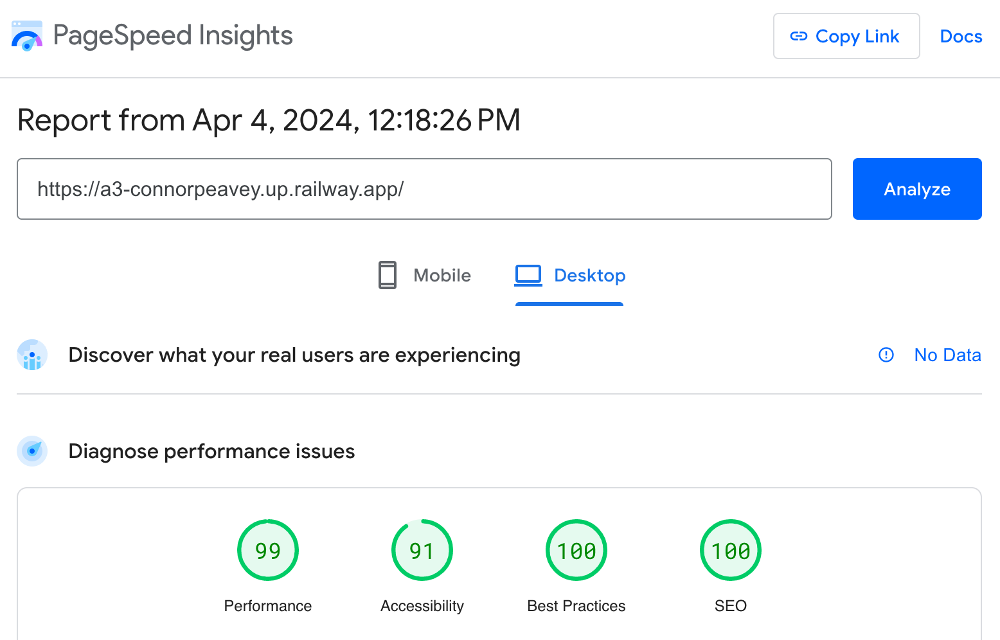
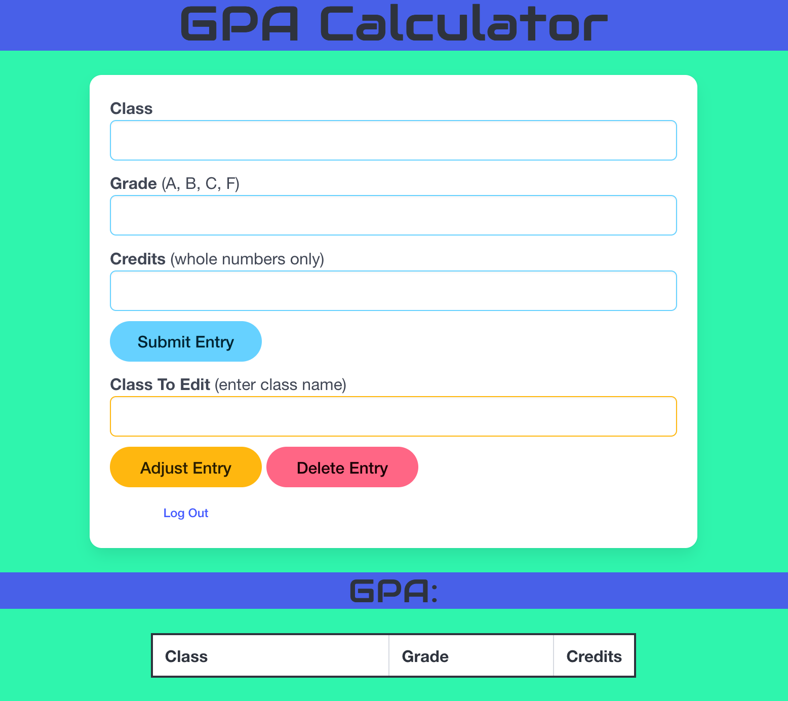
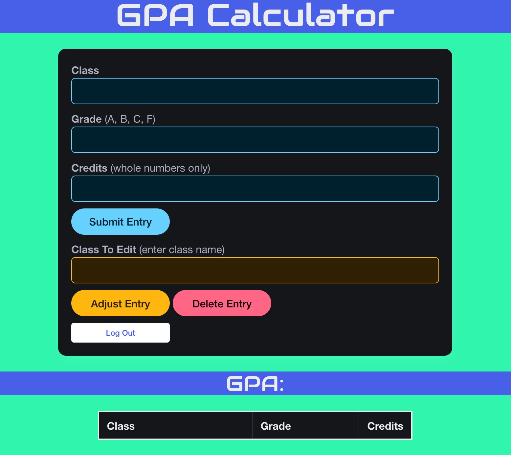

## GPA Calculator

**Webpage Link**: a3-connorpeavey.up.railway.app

This application is a basic GPA calculator, where the user can input classes, the grade they recieved, and how many credits the class was worth, and are then given their GPA, rounded to the nearest hundreths place. Users can make an account with a username and password, allowing their class entries to be saved in a database. The program uses a seperate mongodb database for authentication. While I had planned to use OAuth, time proved to be an issue, which was a hurdle I overcame by having the program access multiple different databases. The Bulma CSS framework was used as it provided a clean, modern aesthetic that was easily scalable to meet the needs of this application. All pages on this site achieved at least 90% on the Google Lighthouse tests.

## Technical Achievements
- **Tech Achievement 1**: I hosted the website on Railway instead of Glitch. Railway automatically updates pages after changes are made to the linked GitHub repo, maing it much easier to stay up to date while testing, especially when I was trying to get the Google Lighthouse score up. (5pts)
- **Technical Achievement 2**: The website allows the user to easily log out of their account and return to the home screen, making it easy for users to have multiple accounts if needed. (5pts)

### Design/Evaluation Achievements
- **Design Achievement 1**: Elements on the website change depending on the user's color settings. If the user is in light mode or dark mode, website elements will adjust accordingly to ensure everything is legible and not overly straining on the eyes. (10pts)

