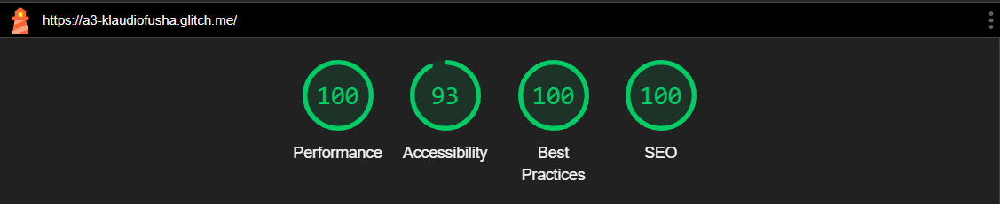

Assignment 3 - Persistence: Two-tier Web Application with Database, Express server, and CSS template
===
## Dungeons and Dragons Character Storage

Hosted on Render: https://a3-aidanmacnevin.onrender.com

This web application serves as a storage point for Dungeons and Dragons Characters, as well as a starting point for newer players. Users are able to submit a character name, race, class, and select a primary type of action. On submission, the character will be added to the table, the primary modifier of the class will be displayed, and a random action will be assigned.
You can delete entries or modify them with the buttons on the right of the table. With the edit button, you can adjust the modifier or action if the derived value is not as expected.

You can sign in with any username and password, the characters stored in will be unique to the user. Account will be created if it does not already exist. For examples of stored data, use the login: 
- **username:** admin 
- **password:** admin

When creating this application, I had some difficulties with passing the new user/bad user information I wanted from the server to the client, but I was able to find a solution. However, I felt that converting the server to be an express server was straightforward after I converted the first few methods. 

I used express-session and mongodb for my user authentication. While it is not extremely secure, this website does not hold sensitive information and decided I did not need to focus on security. As such, I felt that this method would be the easiest way to implement user authentication.

I used the SimpleCSS framework to style my Web App.

## Technical Achievements
- **Hosting on a Non-Glitch Service**: I hosted my web app on Render, following the suggestions from Milo and Andrew in the Slack channel. Deploying on Render was straightforward and easy to do. It was very similar to Glitch, though it took a bit longer to deploy. However, it was easy to set the environment variables, any setup commands, and had the ability to deploy from different GitHub commits easily. 

- **Lighthouse Tests**: I got 100 on all 4 lighthouse tests for both my login page and main app page.    
  - 
  - 

## Design Achievements
- **W3C Site Accessibility**: I followed 12 tips from the W3C tips for Writing, Designing, and Development
  - **Writing**
    - _Provide informative, unique page titles_: I titled both the login and the main web pages. For example, my main page is titled "Dungeons and Dragons Character Storage - CS4241 Assignment 3" which describes the site, as well as why the site was created. It shows the class and the assignment.
    - _Use headings to convey meaning and structure_: On my main page, I used headings to break up the different sections of the page, such as the character entry form, the edit form, and the character table
    - _Provide clear instructions_: The main page includes instructions on how to use and interact with the page. Additionally, in the case of errors such as incorrect password or missing form entry the user is informed as to what went wrong. 
    - _Keep content clear and concise_: The instructions on the main page are clear and concise. In addition, the warning popups mentioned prior follow this trend. 
  - **Designing**
    - _Provide sufficient contrast between foreground and background_: The SimpleCSS framework I used has contrast between the foreground and background
    - _Ensure that interactive elements are easy to identify_: All elements that are interactive are easily discernible. Things like text entry forms are clear and grouped together. Buttons all have a distinct color that is consistent throughout the site.
    - _Ensure that form elements include clearly associated labels_: All form entries have a label to describe its purpose. Additionally, form entries have placeholder text.
    - _Use headings and spacing to group related content_: The main page is grouped by related content, and each has a heading to describe the section.
  - **Development**
    - _Associate a label with every form control_: All labels are connected with a "for" attribute to the entry it is related to.
    - _Identify page language and language changes_: App pages identify the primary language using the html tag lang='en'
    - _Use mark-up to convey meaning and structure_: I used the proper markup tags for the elements on my pages. For example, I used the correct heading tags, table elements, and things like labels for forms. 
    - _Help users avoid and correct mistakes_: When mistakes like invalid password or missing a form question, the user is informed where the issue occurred. 
    - _Ensure that all interactive elements are keyboard accessible_: All interactive elements are accessible via keyboard and tabs. Things like the radio buttons can be selected via up and down arrow keys, buttons and forms can be submitted/clicked via the enter button.

