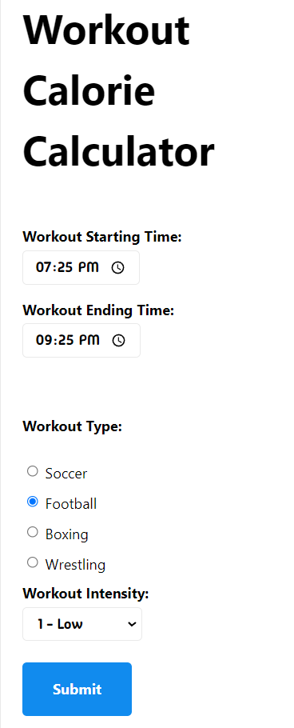
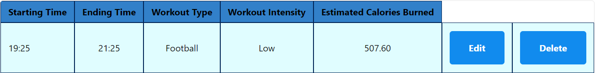
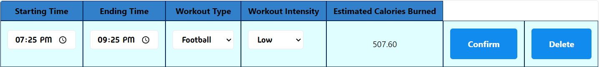

## Workout Calorie Calculator

Klaudio Fusha

https://a3-klaudiofusha.glitch.me/

Include a very brief summary of your project here. Images are encouraged, along with concise, high-level text. Be sure to include:

- The goal of the application was to create a workout calorie calculator that gives users the ability to input a workout starting time and ending time, type, and intensity to get an estimate of how many calories they have burned. Once the form is submitted, data will be dynamically displayed in a results table at the bottom of the page. In that table, users have the ability to view, edit, and delete workout data. Data is stored in MongoDB collections and a new one associated with a GitHub user is created to store proprietary data.
  * The following shows the input form for the calculator:
  
  
  * The following shows a table row with input data and the derived field (estimated calories burned):
  
  * The following shows what happens when you press the 'Edit' button associated with one of the rows:
  

- Implementing GitHub OAuth was a very long process that spanned about 2-3 days. After attending office hours, I was able to figure out what I was doing wrong and finally implemented OAuth login.
- Originally, I was planning on using Auth0 because that was what my soft eng team in CS 3733 implemented for our project. However, upon doing some deep digging, I soon came to the realization that it was pretty difficult. Hence, I stuck with the recommended technical achievement of using GitHub OAuth through passport.js.
- I used the MVP CSS framework (https://andybrewer.github.io/mvp/) because it integrated well with my application. It is a classless framework, which allowed me to still keep my main.css for other styling elements
  - The main things I modified through my own main.css is the color of certain buttons, table headers, table cells, flexbox direction, and the width sizing of certain elements on the page.
- Express middleware packages used:
  * express.static: Allows you to service static files from a directory (in this case /public).
  * express.json: Parses incoming requests with JSON payloads and is based on body-parser.
  * express.urlencoded: Parses incoming requests with URL-encoded payloads and is also based on body-parser.
  * passport: Authentication middleware that allowed for OAuth implementation using the GitHub strategy
  * session: Session-based authentication that allows you to keep track of the user's authentication status across multiple requests

- Google Lighthouse:
  * Login Page: 
  
  
  * Home Page: 
  
  

## Technical Achievements
- **Tech Achievement 1**: I used OAuth authentication via the GitHub strategy. This was done through the GitHub developer settings, where you can create an OAuth application. In those settings, you are given a client ID and can generate a client secret (both of which are to be used in the server.improved.js file to properly communicate with GitHub). These things were hidden from the user through a .env file that was placed in a .gitignore file. Additionally, you can set an application name, homepage URL, and authorization callback URL. To actually get OAuth working for my application, I had to use the passport.js library to initialize the GitHub strategy and import all necessary authentication functions. I was having issues with getting OAuth to work on my hosted website. After playing around with the homepage and authorization callback URLs, I was able to get everything to work properly. In order to make sure that unauthorized users couldn't access my workout calorie calculator, I used an authentication function from the connect-ensure-login library.
- **Tech Achievement 2**: The user can log out of the application. Although it is difficult to ensure a successful logout due to browser cookies and GitHub storing login info for the next time you visit their page, it is a feature that can be used.

### Design/Evaluation Achievements
- **Design Achievement 1**: My site uses the CRAP principles in the Non-Designer's Design Book
  * Contrast: The element that received the most emphasis (constrast) on the login page was the GitHub login button. I found that this was important because I wanted to make sure that the user could easily see the button, especially since it is the only way to log into my site. Upon clicking it, they are brought to a GitHub OAuth login page, which has nice black and white contrast to make it easy for users to input their username, password, and click the large green login button. The element that received the most contrast on the home page of the site was the table. The headers are a dark blue color, while the table cells that contain the actual data are a light blue. The text is black, which allows the user to easily see the information in the table.
  * Repetition: Due to the use of a CSS framework and some stylistic choices in main.css, a lot of elements such as shapes, fonts, sizes, colors, and layout patterns were repeated throughout the pages. The placement of certain things like submit, edit, and delete buttons was predictable. Even the form itself was pretty straightforward, with certain input elements (such as starting and ending time) being grouped together based on their purpose. You can easily notice that I stuck with the same colors throughout (dark blue, medium blue, and a light blue, with of course a white background for both the login and home pages). I used a websafe font (Madimi One) from Google throughout my entire site. I also used a flexbox layout for everything to make that page elements were neatly organized into horizontal grid-like boxes.
  * Alignment: Elements have been placed deliberately to create a clean and fresh look for the website. Through the use of a flexbox in the horizontal direction, page elements are organized in a grid-like pattern that allows for the even spacing elements. Everything has margins to ensure that elements are positioned at the right parts of the screen. Particularly on the home page, it is set up so that the form containing all the workout calorie calculator inputs is on the left side of the page. On the right side, you have a results table containing all the relevant data associated with the logged in user. Table cells are large enough for the user to see and table cells are dynamically added upon form submission to ensure that there is no wasted space on the page.
  * Proximity: I used proximity for all the elements on my website. Regarding the workout calorie calculator form itself, things like starting time and ending time are group together. Workout type and intensity are also grouped together. In the broader context, all of the form elements are grouped together on the left side of the home page. Regarding the results table, it is easy to interpret the data due to the grouping. The table headers and data are in the same order as the input fields (starting time, ending time, workout type, workout intensity, and estimated calories burned). There are edit and delete buttons for each row containing data in the table. The logout button is also relatively close to the table, which make it easy for the user to remember that the data in the table is associated with an account.
