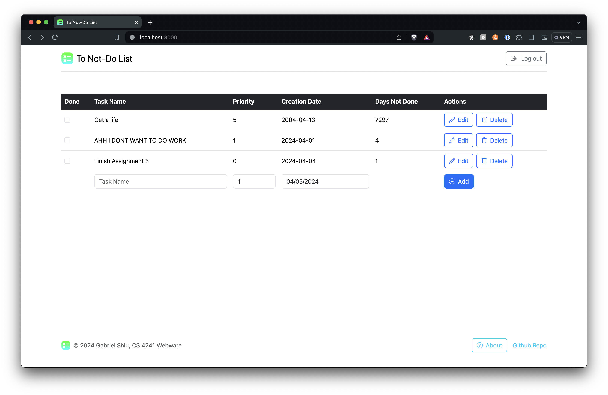

## To Not-Do List
User manages a list of tasks they don't want to do. User can add/edit/delete tasks.

https://a3-gabrielshiu.onrender.com

Challenges:
- Implementing OAuth using passport.js without prior experience and tailoring it to my application
- Choosing a CSS framework that was easy to use and modify, ended up going with Bootstrap
- Making the site accessible using aria roles and labels and design choices

Authentication Strategy
- I used the GitHub OAuth strategy because it was the easiest to implement

CSS Framework
- I used Bootstrap because it was easy to install and use. There were many online tutorials and documentation to help me get started.
- I didn't modify much of the CSS framework because I wanted to keep the design simple and clean.

Middleware Packages

| **Middleware Package**   | **Description**                                                                                                             |
|--------------------------|-----------------------------------------------------------------------------------------------------------------------------|
| express.json()           | Parses incoming JSON requests and exposes the parsed data on req.body.                                                      |
| express-session          | Enables session management for user authentication.                                                                         |
| passport                 | Provides authentication middleware with support for various strategies (here, GitHub).                                      |
| dotenv                   | Loads environment variables from a .env file (for secrets).                                                                 |
| MongoClient              | Mongoose (not directly used) dependency for MongoDB interaction. (MongoClient is the core MongoDB driver used here).        |
| custom function - isAuth | Middleware function that checks for a logged-in user (req.user) before proceeding. Redirects to login if not authenticated. |
| express.static           | Serves static files (like HTML, CSS, JavaScript) from the specified directory ("public").                                   |

## Technical Achievements
- **Tech Achievement 1**: I used OAuth authentication via the GitHub strategy without previous experience. There were great online tutorials to help me.
- **Tech Achievement 2**: I hosted the app on Render. Render was very straightforward to use. It is noticeably slower but it integrates well with Github and automatically redeploys on new pushes.

### Design/Evaluation Achievements
- **Design Achievement 1**: I followed the following **12 tips** from the W3C Web Accessibility Initiative:
  - Writing
    - Provide informative, unique page titles: Made the page title describe the page and added an icon
    - Use headings to convey meaning and structure: On the About page there are different headings to convey overall structure and points
    - Make link text meaningful: Made the log out and log in buttons/links describe what they do. Made the link to my GitHub repo describe what it is: “Github Repo”
    - Keep content clear and concise: Kept About page brief using short, clear wording and included listing and bolding for skimming and simplicity.
  - Designing
    - Provide sufficient contrast between foreground and background: Made the background white so important text and buttons would contrast enough
    - Ensure that interactive elements are easy to identify: Buttons and links are blue to stand out and indicate user interactions like hover
    - Provide clear and consistent navigation options: Navigation is very straightforward with log in and log out buttons. The webpage title indicates when you are on the login page.
    - Include image and media alternatives in your design: Have icons and text side-by-side in buttons
  - Developing
    - Include alternative text for images: Added alt text for images
    - Use mark-up to convey meaning and structure: Used proper header/footer/main tags and assigned roles banner/contentinfo/main
    - Identify page language and language changes: Specified language in html tag
    - Reflect the reading order in the code order: Information appears in correct order in table and throughout
- **Design Achievement 2**: I used CRAP
  - Which element received the most emphasis (**contrast**) on each page?
    - On the login page, the login button is the most emphasized element to encourage the user to log in. It is a filled, primary color button, drastically standing out from the otherwise white page.
    - On the about modal, the header is the most emphasized element to introduce the page
    - On the main page, the add task button is the most emphasized element to encourage the user to add a task. It is a filled, primary color button. This is the only filled button on the screen, heavily contrasting with everything else. The table header of the to not-do list items is also filled with the dark color to contrast the otherwise light white page. This really creates interest in the to not-do list and also provides organization, marking out where the table is in contrast to the header and footer.
  - How did you use **proximity** to organize the visual information on your page?
    - I locate the edit/delete/add buttons in the same column next to each other in the table to organize the actions the user can take into a single location.
    - I make sure to use negative space, creating space around the table to make it the focus of the web page, having space away from the header/banner.
    - I grouped the about modal button and the github repo in the same location in the bottom right in the footer because they are both related to information about the site.
    - The logout button is on its own in the top right of the page in the header because it isn't too related to anything else on the page and that is a traditional placement of login/logout/profile features.
  - What design elements (colors, fonts, layouts, etc.) did you use **repeatedly** throughout your site?
    - I used the primary blue color to signify main actions the user can take to add/edit/delete tasks.
    - I used the info blue color to signify buttons related to information about the page. This includes a button opening up a modal of some "about" information and a link to the github repository.
    - I used the same font throughout the webpage.
    - The table has a consistent layout of rows and columns for the tasks. It also has a column on the right for buttons for actions the user can take.
    - I repeat the logo in the header, footer, browser tab, and login page for strong branding.
    - In the "about" modal, I use consistent spacing, header sizes, and indentation so the user can clearly understand the structure of the document.
  - How did you use **alignment** to organize information and/or increase contrast for particular elements?
    - I left-aligned elements throughout the page for consistency. This is especially useful in a table/list because the user wants to be able to easily skim/navigate the information. It creates contrast between each column while creating unity within the column.
    - Within rows in the table, I vertically aligned elements so the entries of list items would appear unified and it would decrease contrast even though the row is very spread out.
    - I right-aligned the logout, about, and Github repo buttons in the header and footer to organize the page well and show clear boundaries on the webpage.
    - I made sure to vertically align icons with titles in buttons so they would appear unified.
    - I used consistent alignment on the "about" page to organize the information clearly.