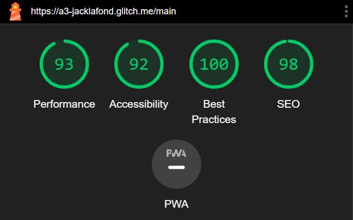

Assignment 3 - Persistence: Two-tier Web Application with Database, Express server, and CSS template
===

Jack Lafond 

http://a3-jacklafond.glitch.me

## Bday Tracker with MongoDB
- The goal of this project was to implement my bday tracker app from A2 in a way that it persists past the life of the server. I also aimed to improve my design and accessibility on the web page.
- Some challenges I faced in this project was implementing the express and mongodb server functions correctly. When trying to update an entry it took me a little bit of time to understand how to use the updateOne() method that comes with the mongodb collection object.
- For authentication I just used one dummy account to login as this didn't take to long to set up and I was more focused on making a better design.
- The CSS framework I used is Sakura.CSS. I chose this framework as it was a lightweight, clean looking framework. For my app I wanted to design to be simple and intuitive so that the forms were easily understood and navigable. I also like their simple use of colors to add just a little bit of flare to the design. https://github.com/oxalorg/sakura
- For middleware I included the following:
  - urlencoded: an express middle ware that encodes incoming url requests as to not show sensitive information
  - static: an express middle ware that allows express to serve static files from a specified directory
  - json: an express middle ware that parses any json in incoming http requests
  - a function provided in the example files to ensure that the database was connected properly before continuing with any other server requests

## Lighthouse Scores

  
## Directions
To access the main page you need to log in with the following credentials:
- Username: admin
- Password: admin

Once logged in you will be redirected to the main application where you can access the data on the server, add, delete, and change entries. I also included a new field, bought gift? which is a yes or no string to represent if you have bought a bday gift for the person in a particular entry.

## Technical Achievements

## Design/Evaluation Achievements
- **Design Achievement 1**: I included an info link to provide information about the main page like how to use it, and the contents on the page
- **Design Achievement 2**: I followed the following tips from the W3C Web Accessibility Initiative
  - Writing:
    - Provided unique and descriptive page titles: For example the main page it called "A3 - Main - CS 4241" which indicates the assignment that this project is apart of, the current page of the application, and the overall class that this assignment is for.
    - Used headings and subheadings to convey meaning and structure: In my main page I use the h1 header about the data table to indicate the main content and I use the sub headers h3 to denote the individual forms. Then each label is a smaller size than the headers to indicate it belongs to that parent header
    - Make link text meaningful: for my info link I labelled it "Click to Toggle Info About This Page" to indicate that this link provided useful information about the current page
    - Provide clear instructions: for the birthday fields a specific format is required which I included in the label "Birthday in the form MM/DD/YYYY:". I also included an alert message on the login page to indicate the error associated with the login if it was unsuccessful.
    - Keep content clear and concise: for my info popup, I organized it in small sentences and paragraphs as well as bullet points in order to convey information in a concise, and less dense way.
  - Designing:
    - Provide sufficient contrast between foreground and background: the css framework that I used implements this already
    - Don't use color alone to convey information: When the info popup is active I underline the anchor link to indicate that it is active
    - Ensure that interactive elements are easy to identify: Sakura CSS does a good job of this already, highlighting the anchor link in a different text color and on hover changeing the look to indicate that it is clickable
    - Ensure that form elements include clearly associated labels: for each form element I included a label, and for the radio buttons I made sure to space them enough so that it is clear which button is for yes and which is for no
    - Use headings and spacing to group related content: Sakura CSS does a good job of spacing already, but I did move the update form next to the add form using flex row in order to make sure that it was visible to a viewer. I also spaced them addequately to help distinguish them using the space-between option.
  - Accessibility:
    - Assocaite a label with every form control: For each label I used the html "for" attribute in order to associate it with its correct input
    - Identify page language: in both the index and main page I included the meta tag with lang='en' to indicate that the html content was in english
    - Use-markup to convey meaning and structure: for every element I used I included the proper markup tag, like using form, label, and input tags in each form, using different levels of hx in order to indicate header level, and using ul and li tags to indicate a list in the info popup
    - Provide meaning for non-standard interactive elements: for the anchor tag link that creates a pop up I included aria-haspopup="true"
    - Ensure that all ineractive elements are keyboard accessible: for the anchor tag I included its tab index as 1, and included an event listener so that if it was focused and a user hits enter, the popup will display. Also for each form it is standard that the inputs can be tabbed, and the buttons will click on enter
- **Design Achievement 3**: I followed the CRAP principles:
  - Contrast:
    For contrast, Sakura CSS does a good job already. The biggest contrast are the bolded headers. The h1 header is the largest and stands out the most, which decreases as the header levels go down. Sakura CSS also slightly bolds the labels for each input which helps stick out from the normal text in order to draw a users eyes there. For the background color the default is a light grey, which allows the bolded headers and labels to stick out well from the background. The contrast between individual elements is good as well. The headers are much larger and bolder then the labels, which helps to denote them as separate. Along with this the button are highlighted with blue. The use of a background color for the buttons help to identify that they are different than just normal text. Along with this the input sections have a background to also indicate that their function is different than just displaying information. One thing I added was that the disabled inputs on the update form have a darker grey background than the normal inputs. This slight contrast helps to indicate that although it is also an input field, it is somehow different which is then understood that it is disabled when you cannot click on it. Lastly, the anchor link it highlighted in blue, so while it does not have a background, the blue coloring in contrast to the regular dark gray coloring indicates that this text is also different from the regular information text. 
  - Repetition:
    For repetition the primary focus was colors. Every interactive element was colored differently than the rest of the page. Sakura again does a good job of this already. For the input fields, all text inputs are the same size, and same backgorund color. For elements that did something, like buttons, links, and radio buttons, they were colored using the accent colors. Anything that is colored in their default blue indicates something that can be clicked. The delete, submit and update buttons are all the accent blue, and the anchor link is blue as well. When an interactive element like these are hovered, they are colored by the purple accent. This helps to indicate that anything blue that shifts to purple when you hover means that it can be clicked, and also helps to indicate that you are currently focused on that thing. One thing I added was I changed the radio select color to match the accent purple to keep the colors consistent and indicate that it was selected. Another repitition I included was using some indicator after every label like ":" or "?" in order to indicate that an answer was needed from the user following that label.
  - Alignment:
    The default settings for Sakura uses strong alignment. Everything on the page is aligned to the left which creates a strong implied line, and a neat feeling to the page. Along with this there is no padding or margin to the forms, which helps carry the line down the page. This helps a reader quickly follow the content down the page all the way to the submit button, almost like a call to action to start adding new entries. Within the data table there is also strong left alignment for each category. This helps a user parse through the entries quickly. For example if a user was looking for a specific person the can follow the list of names down and quickly find them since they are all aligned the same. Within the forms there is a left alignment as well with no padding. This is good for the forms as it helps a user quickly navigate from one input to the next, filling in one and then finding the next one they need to fill in. One thing I did change was aligning the forms in a flex-row container. This creates another strong line across the top of the forms which helps to separate the data info section of the page from the form section of the page.
  - Proximity:
    Sakura uses margins well in order to establish good proximity practices. Each section is separated from other sections by a good amount of spacing. The bottom of the data table to the top of the forms is enough space to indicate to the user that they are separate. Within the data table the individual rows are tightly packed to show that they are all in the same collection of data, while the columns are spaced well to indicate that the values belong to different attributes of their respective entries. Within the forms the spacing is tight to indicate to a viewer that these elements are all within the same form. Each header of the page is closely located to its respective content in order to indicate which headers belong to which content. Some changes I made was using the space-between attribute on the forms in order to give them better horizontal spacing and separate them visually. Another change I made was to put the radio options on the same line in order to better associate themselves with the same label of "Bought Gift". However I did add some spacing between the options so that it was clear to the user which selection belonged to which answer, as each option was now much closer to their actual label than the other option.
    
