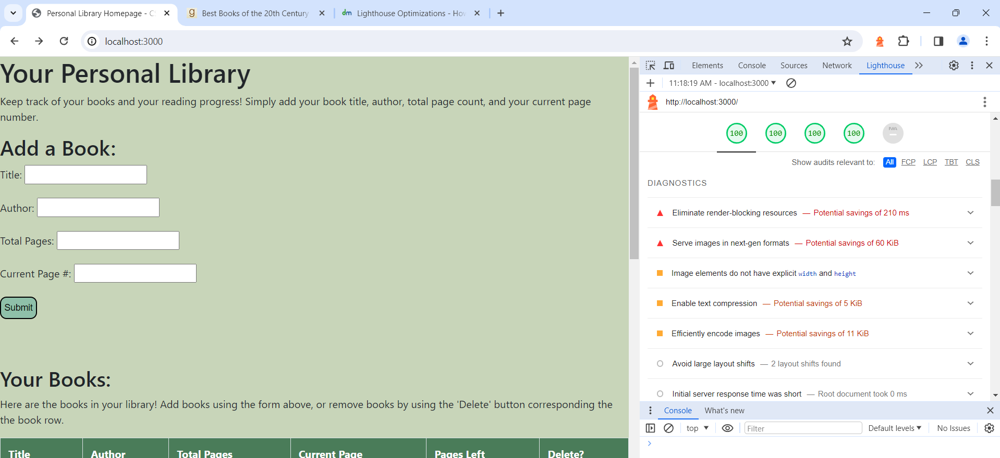

## Your Personal Library

Glitch: http://a3-jolenepern.glitch.me

This personal library application allows users to log their books and their reading progress within an account. Users are able to add, delete, and modify responses. 

## Challenges
When creating this application, I found it very challenging to connect my database to MongoDB, especially adding the capability to modify and delete data.  I also had a very hard time implementing an authentication strategy. 

## CSS Framework
I chose to use the Bootstrap CSS framework, as I have heard that it is a very popular and widely-used CSS framework. 

## Technical Achievements
- **Tech Achievement 1**: I got 100% in all four lighthouse tests required for this assignment.

## Design/Evaluation Achievements
- **Design Achievement 1**: I followed the following tips from the W3C Web Accessibility Initiative.
1. Provide informative, unique page titles: I ensured that the title was unique yet informative. 
2. Use headings to convey meaning and structure: I used clear heading to indicate primary features such as adding a book and managing the database. 
3. Make link text meaningful: I included a link to the top books of the cnetury according to GoodReads and embedded the link in the words rather than "link"
4. Write meaningful text alternatives for images: I included images for popular books, and wrote text alternatives that included the book title and author name. 
5. Provide clear instructions: I provided instructions for how to add a book, manage the database, and gave recommendations for books that users might find interest in reading. 
6. Keep content clear and concise: I used minimal words to convey my information and relied more on formatting to direct users to navigate the page. 
7. Provide sufficient constrast between foreground and background: I utilized tools such as Lighthouse to ensure that all elements of the site had enough contrast, including the foreground and background. 
8. Ensure that form elements include clearly associated labels: I checked that the form was clearly labeled and intuitive. 
9. Provide easily identifieable feedback: When an error occurs in form input, a message pops up with clear instructions to fix the error. 
10. Help users avoid and correct mistakes: An alert pops up if the form is missing input, which is very visible to users.
11. Reflect the reading order in the code order: I ensured that the HTML structure utilized divs to create sections that reflect the reading order of the site. 
12. Identify page language and language changes: I indicated the primary language of each page in the code. 

- **Design Achievement 2**: I uses the CRAP principles in the Non-Designer's Design Book readings. 
  The element that received the most emphasis on my page was the "Add a Book" form on the main page. This form allows users to add a book to the database called their "library" via a form that takes in a title, author, total pages, and current page number. I created contrast on the page by encapsulating this form in a rounded box on the page. By making the rounded box a different color than the site's background color and adding a box outline, the user can identify this box as the form that is provides a different feature than the rest of the site. This is important because I want users to immediately be drawn to the form, which is one of the main components of the website. 

  I used proximity to organize the visual information on the page by creating essentially 3 sections to my main page - the form, the results, and book recommendations. I used empty space in between each of these sections to naturally indicate that they are separate and provide a different function or type of information on the page. I also utilized the table, which essentially lowers the proximity of the data to be all in one spot, indicating that the data are all related and part of the same database. I also used proximity for the spacing between the book images in the book recommendation section. I placed all of the books on the same row side-by-side, although did give a bit of padding, but displaying them all in the same row indicates that they are from the same source and related, as they are all books.   

  I primarily relied on the Bootstrap CSS framework required for this assignment to create consistency in my design elements throughout the site. This primarily impacted the font and element spacing throughout my site from section to section. I used a color palette throughout my site as well, so you can repeated see two tones of green in the background and in the button formats. The buttons were one of my primary design element that was repeated the most, as there are many buttons used to submit the form and delete data. Because of the sheer number of buttons, I wanted it to be consistent. By changing the color and rounded the courners of the button, I feel that it is both more functional and aesthetic. 

  I used some alignment to organize information on my site. Most of my elements were left-aligned, as that is the natural format for reading for the majority of people. For the tables, I used alignment by having the table span across the page, indicating that it was important and one of the key features of my site. I did add more alignment for the book recommendations section, as I wanted to display three images of book covers that are featured on the Goodreads list. I used center-alignment and added padding using Boostrap's column feature to make them all line up in the same row but not too crowded. Overall, I wanted to use simple alignment that is intuitive such that users could focus on the primary features of the site - the form, results table, and book recommendations. 
