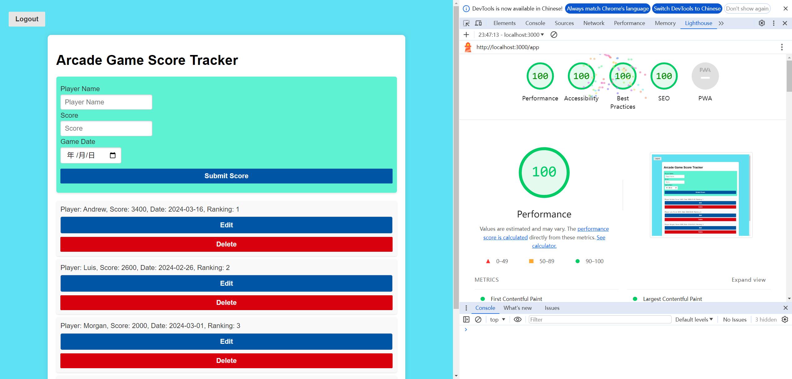

Readme
---

## Application - Arcade Game Score Tracker

glitch link: http://a3-zeshengchen.glitch.me

This web application serves as a user-friendly platform to track and manage arcade game scores. 
It provides functionality for users to log in, 
view their score history, and add, modify, 
or delete their scores. 
The application maintains user sessions to ensure a secure experience.

To login, you can either using:

Username: admin,
Password: admin

Username: admin1,
Password: admin1

Username: admin2,
Password: admin2

Username: admin3,
Password: admin3

Or you could also just create a new account by inputting your desired Username and Password. The server will store it and you can access it once the account is created.

- **the goal of the application**: The main goal of the Arcade Game Score Tracker is to provide a dedicated space for arcade gamers to record their game achievements, compare their scores, and track progress over time.

- **challenges you faced**: One of the significant challenges was implementing a user authentication system that balances security with ease of use. Even I used a simple session-based authentication, it still costs lots of time to figure out the accessibility while maintaining all the functionalities. 

- **what authentication strategy you chose**: For authentication, I chose to use session-based authentication with 'express-session' because of its simplicity and effectiveness for maintaining user state across HTTP requests without compromising security.

- **what CSS framework you used and why**: I chose the Pure CSS framework for its lightweight and responsive features.
  - custom CSS you authored
    
    - adjust the color scheme, ensuring it meets the WCAG AA contrast ratio guidelines.
    - media queries were added to enhance the application's responsiveness

- **the five Express middleware packages used**: 
  
  - **express.static**: Serves static assets such as HTML, CSS, and JavaScript files.
  - **express.json()**: Built-in middleware in Express to parse incoming requests.
  - **express-session**: Manages user sessions, storing session data on the server, allowing the same user across multiple interactions.
  - **MongoClient**: Although not a middleware, used in conjunction with Express to connect to MongoDB.
  - **checkAuth (Custom Middleware)**: Checks if the user is authenticated before allowing access to certain routes. If a user is not authenticated, it sends a 401 Unauthorized response, ensuring that only authorized users can perform specific actions.

## Technical Achievements
- **Tech Achievement 1**: I got 100% in all four lighthouse tests required for this assignment. I saved a screenshot 'LighthouseTestingResult.png' to show it. Feel free to also test it using Lighthouse

### Design/Evaluation Achievements
- **Design Achievement 1**: I followed the following 12 tips from the W3C Web Accessibility Initiative
- Implement a consistent color scheme

  - Updated button color scheme to meet WCAG AA contrast ratio guidelines
- Ensure all forms have labels

  - Organized form inputs with fieldsets and legends for better structure
- Make sure that all interactive elements are keyboard accessible

  - Enhanced keyboard navigation by adding clear focus styles to interactive elements
- Screen Reader Navigable

  - Implemented semantic HTML and ARIA roles to ensure screen reader works
- Feedback for Interactive Elements

  - Added user feedback for interactive elements such as alerts for successful form submissions or account creation
- Optimize Tab Order

  - Reviewed and optimized tab order to be logical and intuitive
- Use Responsive Design

  - Making the application accessible on a range of devices using 
    - @media (max-width: 768px) {
      .container {
      width: 95%;
      margin: 10px auto;
      }
    }
- Clear Error Messages

  - Created informative log messages to guide users through account login
- Ensure that all interactive elements are easy to identify

  - using '  transition: background-color 0.3s ease;
    ' in css file to adding hover effects, making it easier for users to identify clickable items
- ARIA Landmarks

  - Used ARIA landmarks to define regions of the page, using ARIA roles where necessary
- Optimize Form Inputs

  - Enhanced form inputs with specific types and validation patterns to ensure game score data quality
- Ensure that form elements include clearly associated labels

  - Ensuring that add score form elements have associated label tags
