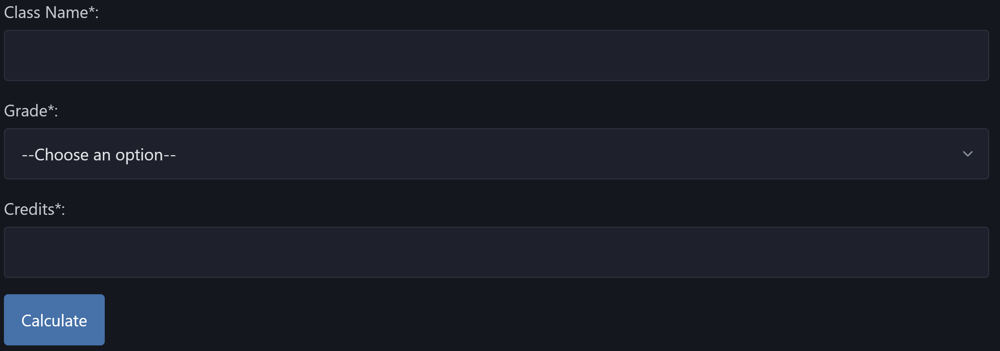
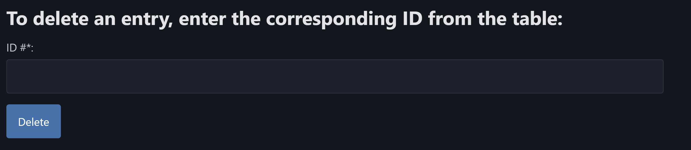
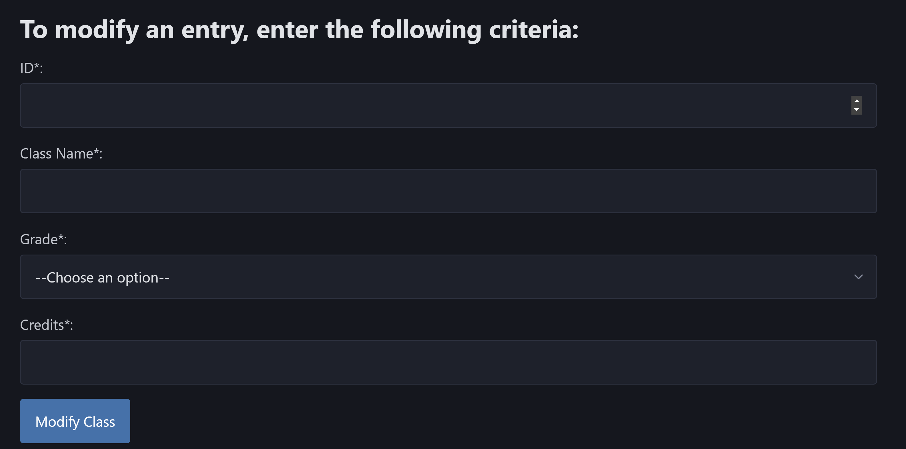

## Your Web Application Title

Include a very brief summary of your project here. Images are encouraged, along with concise, high-level text. Be sure to include:

- The goal of my application is to store information from a user on their specific college classes, using that information my application returns the user's cumulative GPA. Users have the ability to add, delete, and modify entries via buttons and view their GPA in real time. 
  The cumulative GPA is shown to the user as follows:  . 
  Once all associated fields in that section are filled in, the calculate button will be clicked to add a class to the users table entries and recalculate their GPA as shown here:  .
  Once all associated fields in that section are filled in, the delete button will be clicked to delete a class from the users table entries and recalculate their GPA as shown here:  .
  Once all associated fields in that section are filled in, the modify button will be clicked to modify a class in the users table entries and recalculate their GPA as shown here:  .

- I faced many challenges with implementing the cookies strategy of using the serializeUser and deserializeUser functions. There were times where I thought I fixed my issue but then 20 minutes later the code would break in the same place. I realized later on that my issue was with the attribute I was trying to use in the serializeUser function. I was happy to overcome this challenge because it was one of the final obstacles I had to overcome before having my OAuth implementation fully work. 

- I chose OAuth via Github as my authentication strategy because it seemed to be easier than having to handle a manual login since it github provides a special id back that I got to use. This really streamlined my login implementation since it took out a lot of the in between stuff I would have to otherwise handle. Furthermore, there was plenty of online documentation of this strategy so I was able to look at the passport.js guidelines in times where I felt lost. 

- I used the Pico css framework since it is minimalist and prioritizes semantic syntax, making every HTML element responsive and elegant by default. It required the least amount of editing and I liked how it offered a dark mode with a high enough contrast. Furthermore, this framework helped me reach 100% on every lighthouse test which I appreciated extra. 
  I did not modify the CSS framework with my own CSS, I did not delete the CSS file from my folder even though it is not referenced in either my html files because that made me feel a little uneasy. Ultimately the only styling on my application is that provided by pico.css, I did not include a customize css as stylesheets for either of my html files.

## Technical Achievements
- **Tech Achievement 1**: I used OAuth authentication via the GitHub strategy. To accomplish this I registered my application on github identifiying its homepage URL and redirect URI. I then connecting this to my application by putting the client ID and secret in the .env file which is hidden. From there I installed passport.js functionality as well as the github strategy to enable the OAuth process. Finally, I combed through many documentation and tutorials to understand the implementation process and use of the github strategy for OAuth. I had a challenge with redirect URI at first, it took about 3 hours for me to realize I was missing a slash in my app.get. Furthermore, I had a hard time keeo unauthorized users out of the main page, however, I used a combination of the inclass code cookie example to understand whether a user is logged in or not to ensure that only logged in users have acccess to profile page. 
- **Tech Achievement 3**: I achieved 100% on all 4 of the lighthouse tests. I did this as a trial and error process. I began by analyzing my intial payload then taking the google suggestions and updating my code accordingly. By taking a gradual piece by piece approach I was able to reach 100% on all 4. This was challenging when using the css frameworks because a lot of them added on many features that slowed down the page since they were unused by me in my html, this led to me using pico.css which I found enhanced my lighthouse score! 

### Design/Evaluation Achievements
- **Design Achievement 1**: I followed the following 12 tips from the W3C Web Accessibility Initiative:
  1. *Provided a short title that describes the page content and distinguishes it from other pages*. I gave both of my pages appropriate titles that are unique to their functionality with the most relevant information first.
  2. *Used short headings to group related paragraphs and clearly describe the sections.* I made good use of headings and subheadings that provide an outline of the content and what needs to be done. 
  3. *Kept content clear and concise: Write in short, clear sentences and paragraphs. Avoid using unnecessarily complex words and phrases. Expand acronyms on first use.* I ensured that all instructions were straight to the point and no longer than 1 sentence. I used plain terms to describe my instructions and avoided the use of any abbreviations. 
  4. *Provided sufficient contrast between foreground and background*: My text has sufficient contrast with background colors that were approved by google lighthouse's accessibility test. 
  5. *Ensured that form elements include clearly associated labels.* All my fields have a descriptive label adjacent to the field. I avoided having too much space between labels and fields. I included lines and headers to split sections. 
  6. *Used headings and spacing to group related content.* I used whitespace and proximity to make relationships between content more apparent. I also added lines to divide sections accordingly. 
  7. *Associated a label with every form control* Used a for attribute on the <label> element linked to the id attribute of the form element.
  8. *Identifed page language.* Indicated the primary language of every page by using the lang attribute in the html tag: <html lang="en">. 
  9. *Reflected the reading order in the code order* I ensured that the order of elements in the code matches the logical order of the information presented. If I remove CSS styling and the order of the content makes sense.
  10. *I did not rely on color to convey information.* Provided identification that does not rely on color perception by using words to instruct a user where to delete an entry rather than using the color red with no words.
  11. *Provided clear and consistent navigation options.* Ensured that navigation across pages within a website has consistent naming, styling, and positioning. 
  12. *Made link text meaningful.* Wrote my github OAuth link text so that it describes the content of the link target. Avoided using ambiguous link text.