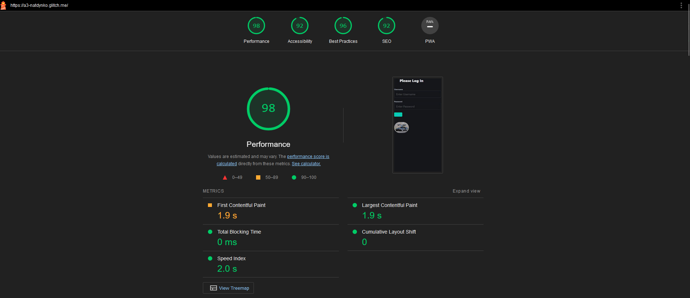

## A3-natdynko

http://a3-natdynko.glitch.me

For this assignment, I improved my developement of the car storage web app by introducing a backend MongoDB database to store persistent data as well as a log in system so that the collection remains secret. Setting up Express and MongoDB were relatively simple, with the majority of the work being put into developing a log in page as well as styling with Bulma CSS framework. I feel that a lot of CSS frameworks that I tested out felt very limiting to the point where it almost felt more worthwhile writing my own CSS. However, the Bulma framework in particular made it very easy to develope mobile-safe webpages, which boosted my Lighthouse score a good amount

As for Express middleware, I used the following:

- Express-session: This express middleware allows for cookies to be stored within a given user session which allows a previously logged in user to be reauthenticated without needing to sign in explicitly. 

## Technical Achievements
- **Tech Achievement 1**: When initially running the server and logging in, the first inputted username and password will be the set login for that user. Any future attempts to log in to the secret car database (without restarting the server) will need to supply the same username and password. If they do not match, an error message will appear. Even if the user tries to use directory traveral to try to access the main page, it will block them due to them not having the proper session token gained through authenticating. (5 points) (usual user is `test:test`)
- **Tech Achievement 2**: In order to allow for the user to dynamically update and delete personal items, I scripted the `main.js` file to create custom "update" and "delete" buttons for every entry that mapped to a corresponding "_id" in the database. This made it so when a user clicked one button, it would automatically perform that action on the database and reload the table to show the updated values. In order to update a value, the user simply has to input the changes into the given boxes, then click "update" to update an entry with the new data. (10 points)

### Design/Evaluation Achievements

